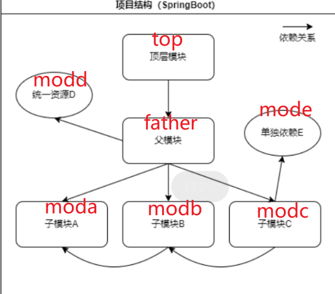

# POMAutoGen

module-7的组件，用于分析循环依赖，并自动构建多模块项目的全部配置文件（pom.xml），便于一键部署（待拓展）

## 基本介绍

项目名称为DAG，主要功能有二：

1. 循环依赖检验
    - 从数据库中抽取信息，构建有向无环图（DAG）
    - 显示每个模块对其他模块的依赖
    - 对DAG进行拓扑排序，确保没有循环依赖
2. POM自动构建
    - 根据模块之间的依赖（确保无循环依赖），以及模块对Maven库的外部依赖，就可以自动构建springboot多模块项目的全部pom.xml文件，并输送到指定位置
    - 使用前需要对项目进行最基本的配置，比如目标多模块项目根目录
    - 两个依赖都放在数据库的表中，分别为depend和outer_depend

## 使用细节

### 项目结构

项目为基本的springboot架构，分为5个package：

1. utils：储存基本的通用工具，比如图的数据结构定义
2. entity：基本实体类，与数据库的表项对应
3. mapper：基于mybatis的SQL语句映射接口，配合resource里的xml文件可以简单地实现mysql的读写
4. service：核心业务逻辑
    - DBService：数据库的基本显示
    - GraphService：图的构建，显示，依赖分析
    - BuildService：项目pom的自动生成，目标项目的核心配置就在此类中（比如目标根目录，项目名）
5. controller：web显示，在浏览器输入指定URL即可调用程序接口，并在浏览器查看运行结果反馈，已有功能如下
    - 查看全部内部依赖：/dependencies
    - 查看全部外部依赖：/modules
    - 查看邻接表形式的依赖关系：/graph
    - 循环依赖分析：/analyze
    - 自动构建pom.xml：/build

### 使用方法

1. 先在mysql中导入数据库，并打开mysql服务（.sql文件在“数据库文件”目录中）
2. 运行DagApplication
3. 假设为本地运行，则输入`localhost:8080/dependencies`即可查看数据库中的依赖，再输入`localhost:8080/modules`查看外部依赖
4. 二者无误后，进行图构建，打印图，依赖分析，最后进行自动构建
    - 以multimod项目为测试用例，我已经将其放在根目录之下，并配置BuildService的目标目录为multimod
    - 你可以删除其中的pom进行构建测试，检验是否可以恢复
    - 恢复后打开对应的项目，运行，检验效果
    

测试用例说明：

1. 项目为multimod
2. 依赖结构如下图所示，结构很简单
3. 测试方法也很简单，令叶节点值为1，非叶节点值=所有被依赖节点值之和，最终结果应该为5，此结果代表模块之间的依赖完全无误
4. 启动项目后，在浏览器中输入`localhost:8080`，如果结果为5，那么就代表依赖无误

