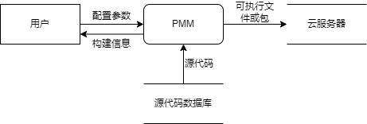
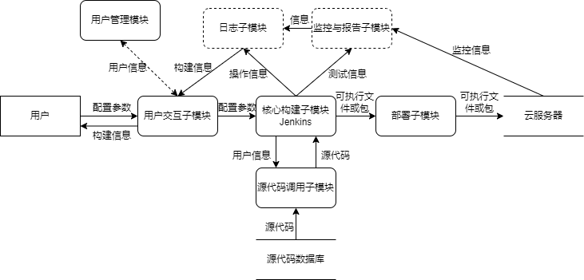

# 软件需求规范说明文档（PMM）

## 版本历史

| 版本  |    日期    |  作者  | 说明                 |
| :---: | :--------: | :----: | :------------------- |
|  1.0  | 2023-10-18 | 李昊阳 | 初始版本             |
|  1.1  | 2023-10-20 | 李昊阳 | 更新了需求和用例描述 |
|  1.2  | 2023-10-23 | 李昊阳 | 更新了数据流图       |

## 1. 引言

### 1.1 标识

- 项目名称：基于低代码技术的SAAS平台 / Low-Code SaaS Platform
- 模块名称：发布与管理模块 / Publishing and Management Module
- 缩略名：PMM
- 版本号：1.2

### 1.2 系统概述

- 模块概述：本模块允许用户对应用程序进行打包、发布、升级，并监控应用程序的性能和稳定性。包括自动构建、持续集成、版本控制、性能监控和备份。
- 投资方：该项目暂不进行任何营利活动，无投资方。
- 需方：卓越工程课题组。
- 用户：企业业务人员、开发人员、学生等；
- 开发方：卓越工程第五小组（李昊阳，赵炫皓，陈耀宇）。暂无支持机构。
- 运行环境：该项目运行在本地开发环境中，并计划部署到云端服务器中，为用户提供网页端服务。软件的运行现场包括企业业务开发、学生学习等。
- 其他相关文档：软件设计文档、软件测试计划和用户手册等。

### 1.3 文档概述

本文档用于定义“发布与管理模块”（BIT-Low-Code-SaaS-Platform项目，第七模块）的详细需求规范，以便开发团队能够理解和满足项目的需求。无保密性要求。

### 1.4 基线

无。

## 2. 引用文件

胡思康. 软件工程基础. 北京:清华大学出版社, 2019.

## 3. 需求

### 3.1 所需的状态和方式

本需求已确认。
本模块为自主开发产品，并在符合相关协议下使用开源框架，不属于任一系列产品或现有软件的升级产品。

### 3.2 需求概述

#### 3.2.1 目标

- 模块的目标是允许用户对应用程序进行打包、发布、升级，并监控应用程序的性能和稳定性。包括自动构建、持续集成、版本控制、性能监控和备份。
- 本阶段的目标是构建本模块框架，实现用户配置构建任务的功能：
  - 用户能够配置Jenkins构建任务，指定如何构建应用程序。
  - 代码更改后，Jenkins自动触发构建任务，检索源代码，执行构建，生成应用程序的可执行文件或包。

#### 3.2.2 运行环境

- 软件环境：操作系统：Windows 10及以上版本。无特殊要求。
- 硬件环境：Windows 10支持的最低硬件配置。

#### 3.2.3 用户特点

用户是企业业务人员、开发人员等，这些用户可以不具备深度的编程技能，但了解业务流程和需求。用户使用低代码平台来创建和自定义业务应用程序，以满足特定的业务需求，而无需编写大量的代码。

#### 3.2.4 关键点

- 关键功能：用户配置构建任务。
- 关键算法：暂无。
- 关键技术：Jenkins等。

#### 3.2.5 约束条件

- 文档权限：开发者有权访问本文档；
- 代码权限：开发者拥有本模块代码的访问与修改权限；
- 开发期限：需在卓越工程课程周期内完成本模块的迭代开发；
- 经费限制：无经费。

### 3.3 需求规格

#### 3.3.1 软件系统总体功能/对象结构

- 用户能够配置Jenkins构建任务，指定如何构建应用程序。
- 代码更改后，Jenkins自动触发构建任务，检索源代码，执行构建，生成应用程序的可执行文件或包。

0层数据流图：

#### 3.3.2 软件子系统功能/对象结构

- 本模块分为用户交互子模块、核心构建子模块、源代码调用子模块、可执行文件或包部署子模块。后续会根据其他功能划分监控与报告子模块、日志子模块等，并接入用户管理模块。
- 用户交互子模块负责处理与用户的交互，用于配置构建任务、设置触发器、查看构建状态以及执行手动操作。
- 核心构建子模块： 这是持续集成的核心部分。核心构建子模块负责自动构建、编译、运行测试和生成构建产物。它执行从源代码到可部署包的完整构建流程。这确保了每个构建是一致的，减少了人为错误，提高了构建质量。
- 源代码调用子模块： 这个子模块用于管理源代码。它可以与源代码存储库（如Git）进行交互，获取最新的源代码、检查更改和触发构建。源代码调用子模块确保了构建过程的及时性和准确性，因为它会自动获取最新的代码。

可执行程序或包部署子模块： 一旦构建成功，可执行程序或包部署子模块会负责将构建产物部署到目标环境。这可以包括将应用程序部署到开发、测试或生产环境，根据配置将构建产物复制到适当的位置。这加速了交付流程，确保应用程序及时可用。

1层数据流图：

#### 3.3.3 描述约定

暂无。

### 3.4 软件配置项能力要求

#### 3.4.1 系统功能说明

1. 配置构建任务： 用户配置Jenkins构建任务，指定如何构建应用程序。代码更改后，Jenkins自动触发构建任务，检索源代码，执行构建，生成应用程序的可执行文件或包。

用例图：

#### 3.4.2 系统输入

用户配置的构建任务参数。

#### 3.4.3 系统处理

1. 接收和解析用户配置的构建任务参数；
2. 检索指定版本的源代码；
3. 根据配置的构建脚本和工具执行构建操作；
4. 监视构建过程，捕获任何错误或异常。

#### 3.4.4 系统输出

生成可执行文件或包。

### 3.5 外部接口需求

- 与其他软件的接口：需要与源代码数据库和目标服务器操作系统进行交互，以获取源代码和部署应用程序。同时，要与用户管理等其他模块进行交互。
- 数据通信协议：需要支持多种数据通信协议，如HTTP、SSH等，以确保数据的安全传输。

### 3.6 内部接口需求

### 3.7 内部数据需求

### 3.8 适应性需求

- 操作方式上的变化：支持用户配置构建任务的方式或参数的更改。
- 运行环境的变化：不支持不同运行环境的变化，应用程序仅在指定的云端服务器上运行。
- 同其他软件的接口的变化：模块应具有可扩展的接口，以适应与其他软件的集成和接口的变化。
- 精度和时限的变化：精度要求必须严格遵守；时间要求可随项目需求或开发的变化进行灵活调整。
- 计划的变化或改进：模块需求分析与设计应随计划的变化而改进，确保项目的顺利进行。

### 3.9 保密性需求

无保密性需求

### 3.10 保密性和私密性需求

需要确保用户配置信息和源代码的安全性和保密性。

### 3.11 环境需求

能够适应不同的运行环境和目标服务器的变化。

### 3.12 计算机资源需求

#### 3.12.1 计算机硬件需求

- 处理器：具备足够处理能力的服务器或云虚拟机。要求支持并行构建和部署任务。
- 内存：应足够大以支持系统的正常运行。无特殊要求，一般为8GB。
- 存储设备：用于存储系统构建的可执行文件或包、日志和报告。无特殊要求。
- 显示器：由模块1调用，与用户进行交互。
- 键盘/鼠标/触摸屏：由模块1调用，作为用户的输入设备，输入配置参数。
- 网络设备：支持数据传输到目标服务器。

#### 3.12.2 计算机硬件资源利用需求

- 系统应合理利用计算机硬件资源，确保任务的高效执行。
- 应尽可能减少资源的浪费和重复构建。

#### 3.12.3 计算机软件需求

- 操作系统：Windows 10及以上兼容版本。
- 开发工具：Java：IntelliJ IDEA Community Edition。
- 第三方工具：Jenkins。

#### 3.12.4 计算机通信需求

本系统不涉及网络通信，无通信需求。

### 3.13 软件质量因素

- 功能性：系统应能够按照需求生成四则运算题目，包括不重复、支持不同的运算符和括号、支持整数和真分数等。
- 可靠性：系统生成的题目应符合要求，答案判定应准确无误。
- 可维护性：系统应采用面向对象的编程方法，代码结构应清晰、模块化，易于理解和修改，方便维护和更新。
- 可用性：用户应能够方便地访问系统，生成题目、输入答案，并查看结果。
- 可重用性：系统的组件和功能应设计灵活、可扩展，以便将来能够方便地被其他应用程序或系统重用。
- 可测试性：系统的代码应具有良好的结构和可测试性，以便进行单元测试、集成测试和系统测试，确保功能的正确性和稳定性。
- 易用性：系统的输出应直观、清晰，命令行操作应简单明了，用户能够快速上手并顺利完成任务。

### 3.14 设计和实现的约束

- 严格采用面向对象方法设计，实现高独立性、高拓展性、高实用性。
- 采Java编程语言实现，代码需符合Java语法标准，代码需易读、简约，无逻辑错误，符合内部接口需求。

### 3.15 数据

- 数据输入类型：用户配置数据、源代码、构建参数、部署参数。
- 数据输出类型：可执行文件、包、构建报告、部署报告。
- 媒体和格式：输入数据可以通过用户界面或JSON配置文件提供。输出数据可以包括可执行文件、ZIP包等二进制格式，以及HTML、JSON、XML等文本格式的报告。
- 数值范围：取决于用户提供的配置参数，通常没有特定的数值范围要求。
- 精度：要求确保输入的配置参数正确且无误，以避免构建和部署错误。输出数据的精度要求高，特别是在构建和部署过程的成功或失败状态。

- 示例：
  - 输入：用户通过Web界面提供构建任务的配置参数，如源代码仓库URL、构建脚本、目标服务器信息等。
  - 输出：成功的构建任务将生成可执行文件或包，以及构建报告，描述构建过程和结果。

### 3.4 数据管理能力要求

- 文卷和记录的个数：需要管理用户配置的构建任务和部署任务的个数。
- 表和文卷的大小规模：存储构建任务和部署任务的信息，包括任务配置、状态和日志等。
- 存储要求：应根据任务数量和数据量的可预见增长进行存储容量的估算。-

### 3.16 操作

- 控制方法：软件的运行可以通过Jenkins的Web界面、命令行工具和API进行控制。管理员和用户可以通过这些方法触发构建和部署任务。
- 控制信号来源：控制信号的来源包括管理员、用户和自动化触发器，例如代码提交、定时触发等。

### 3.17 故障处理

- 可能的故障：可能的故障包括软件错误、服务器故障、网络故障等。
- 后果：这些故障可能导致构建和部署任务失败，影响应用程序的发布。
- 故障处理要求：需要实施错误处理机制，包括错误日志记录、任务重试、故障通知等，以尽量减少故障对系统性能的影响。-

### 3.18 算法说明

暂无算法说明。

### 3.19 有关人员需求

相关开发人员应熟悉本需求文档，熟练掌握Java语言，能够灵活运用Intellij等开发软件进行协同开发，具备最基本的软件开发常识。能够使用Github进行代码提交与合并，具有团队合作精神。

### 3.20 有关培训需求

相关开发人员应自行学习本系统有关的算法与数据结构，了解系统底层逻辑。

### 3.21 有关后勤需求

相关开发人员应自行准备开发环境，无后勤需求。

### 3.22 其他需求

- 使用方便要求：用户友好的界面设计和易用性是关键。
- 可维护性：需要支持任务的修改、更新和维护。
- 可补充性：支持添加新的构建和部署任务。
- 易读性：生成的报告和日志应具有清晰的格式和易读性。
- 可靠性：需要确保系统的稳定性和可靠性，以防止构建和部署任务的失败。
- 运行环境可转换性：能够适应不同的运行环境和目标服务器的变化。

### 3.23 包装需求

系统最终部署于云端运行。

### 3.24 需求的优先次序和关键程度

本阶段仅实现一个需求，无优先次序。应保证所有需求都被执行到位。

## 4. 合格性规定

系统应无代码抄袭行为，相关开发人员不应剽窃他人成果。

## 5. 需求可追踪性

需求可被追踪，且每周将发布新的需求。按阶段将更新或编写本系统的软件需求规格说明文档。

## 6. 尚未解决问题

暂无。

## 7. 注释

1. SaaS（Software as a Service）：“软件即服务”的缩写。SaaS是一种云计算模型。用户无需安装、维护或管理应用程序，而是通过云基础设施（通常是网页浏览器）即可访问应用程序。
2. LCSP（Low-Code SaaS Platform）：“低代码SaaS平台”，即本模块父项目的缩写。LCSP是一个软件开发平台，集成了低代码开发工具和SaaS模型。平台允许用户通过可视化建模和拖放组件创建应用程序，加速应用程序开发过程，并在云端运维该程序。
3. PMM（Publishing and Management Module）：“发布与管理模块”，即本模块的缩写。PMM用于管理和发布应用程序。这个模块的功能包括应用的打包、发布、升级、版本控制、应用性能监控与报告等。
